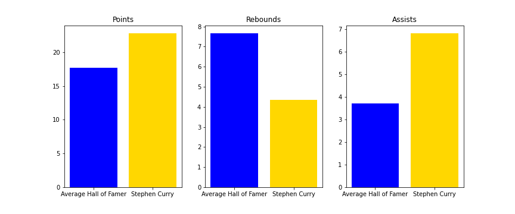

# NBA_Project3


**Authors:** Lorin Helfenstein, Hayden Johnson, Wil Dotson

## Overview
The goal of this project is to create the best predictive model for prediciting whether or not a NBA player will make it into the NBA Hall of Fame

## Business Problem
Right now there is a committee of people who vote on who gets into The Naismith Memorial Basketball Hall of Fame, but they will make mistakes just as all humans do. We created an unbiased model to predict if players should get into the HOF.
We only wanted to look at players career stats, and not have people’s opinions diminish players chances of getting in.


## Data
We examined data from two different NBA datasets. These sets of data included player names and all of their career stats.

## Methods
We first began by creating new features. We added MVPs, Team championships, and Finals MVPs to our dataset. Then we used multiple groupby functions to create a career totals dataframe for all of the players in the dataset. We then removed all the players who had played less than two seasons. The next step was creating new features that turn the total stats into stats per game. This way players who had not played as long as others wouldnt be hurt in the model. Then we conducted a train test split on our data. Next, we used a SimpleImputer() with the median strategy to replace the null values in the 'player_efficiency_rating' column with the median of the other players in the dataset. We then transformed the X_train and X_val to replace the null values of these columns with the median. Then we transformed the already imputed variables with the standard scaler. Next we created a base model using logistic regression. We also used SMOTE to resample our data. We continued tuning our model with hyper paramaters until we got a high enough accuracy and precision score.

This is a comparison between hall of fame stats and average player stats


This is a comparison between hall of fame stats and Michael Jordan's stats


This is a comparison between hall of fame stats and Steph Curry stats




## Results
After a good amount of trial and error we were able to get an accuracy score of .937 and a precision score of .586

# Next Steps
We would like to implement a user interface so that anyone can put in stats of any player and our model could tell them if the player would make it into the hall of fame

## Conclusions
After many models and tries we created a final model. Our final model has a great accuracy score but a lower precision score. In order to improve this model we would need to continue working on raising our model's precision score 


For any additional questions, please contact *Hayden Johnson at hcjohns1@bsc.edu, Wil Dotson at jwdotson@bsc.edu, or Lorin Helfenstein at lehelfen@bsc.edu**

## Repository Structure

```
├── data                                  <- data files used for analyses
├── images                                <- visualizations created
├── notebooks                             <- code written for project with explanation, as well as working notebooks of members
├── microsoftmovieanalysispowerpoint.pdf  <- PDF version of powerpoint
└── README.md                             <- overview of project
```
